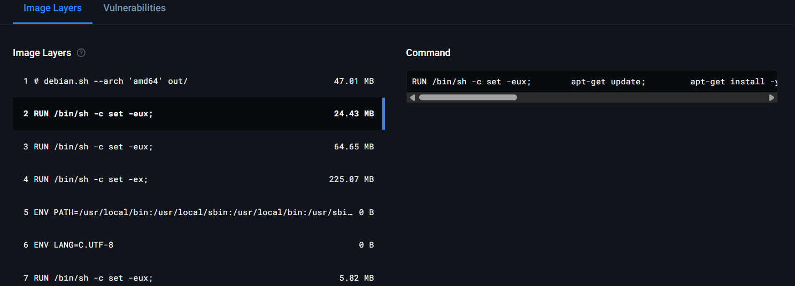
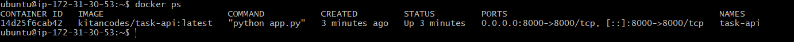

# FastAPI Task Service

I built this project to implement a complete CI/CD workflow around a simple FastAPI application. The focus of this repository is not just the API itself, but the automation, containerization, and deployment pipeline that takes the application from code to a running service on AWS EC2.

The project demonstrates how I structure continuous integration, build reproducible Docker artifacts, version container images properly, and automate deployment to a cloud server.

## Project Overview

This is a RESTful task management API built with FastAPI. It allows users to create, retrieve, update, and delete tasks.

Beyond the API functionality, I implemented:

- Continuous Integration with automated testing
- Docker-based containerization
- Commit-based image tagging strategy
- Continuous Deployment to AWS EC2
- Automated container restart on new deployments

Every push to the `main` branch triggers the full pipeline: tests run, a Docker image is built and tagged, the image is pushed to DockerHub, and the running container on EC2 is updated automatically.

## Technology Stack

- FastAPI
- Pytest
- Docker
- GitHub Actions
- DockerHub
- AWS EC2 (Ubuntu)

## CI Pipeline

I configured GitHub Actions to run on every push and pull request.

The CI workflow:

1. Installs project dependencies.
2. Runs unit tests using Pytest.
3. Fails immediately if tests do not pass.
4. Builds the Docker image only after tests succeed.

This ensures that only verified builds move forward in the pipeline.

## Docker Strategy

I containerized the application to ensure consistency across environments.

For each successful build, I:

- Tag the image as `latest`.
- Tag the image with the commit SHA for traceability.
- Push both tags to DockerHub.

This allows me to trace deployments back to specific commits and maintain reproducible builds.

## Continuous Deployment

I implemented Continuous Deployment to automatically update the application running on AWS EC2.

On every push to `main`, the CD workflow:

1. Pulls the latest Docker image from DockerHub.
2. Stops and removes the existing container on EC2.
3. Runs a new container using the updated image.
4. Starts the container with `--restart unless-stopped` to ensure resilience.

## Live Deployment

## Live Deployment

The application is deployed on an AWS EC2 instance and runs inside a Docker container.

The instance may be stopped when not in use to reduce cost. Deployment proof is included below.

## Deployment Screenshots

### Swagger UI


### DockerHub Image



### EC2 Running Container



## How to Run Locally

Clone the repository:

```
git clone https://github.com/Kitancodes/task-api-docker.git
cd cd task-api-docker
```
Install dependencies:

```
pip install -r requirements.txt
```

Run tests:

```
pytest
```

Build and run the container:

```
docker build -t fastapi-task-service .
docker run -d -p 8000:8000 fastapi-task-service
```

Access the application at:

http://localhost:8000/docs
