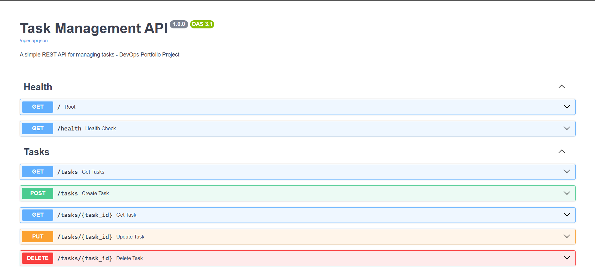

# Task Management API

I built this project to implement a complete CI/CD workflow around a FastAPI application. It's nothing so fancy, it just focuses on automation, containerization, and deployment infrastructure rather than complex application logic.

## What This Is

A RESTful task management API built with FastAPI. The application handles basic CRUD operations for tasks, but the real value is in the DevOps implementation around it.

I implemented:

* Continuous Integration with automated testing on every commit
* Multi-stage Docker builds optimized for production
* Commit-based image tagging for deployment traceability
* Continuous Deployment to AWS EC2
* Automated container orchestration and restart policies

Every push to the main branch triggers the full pipeline: tests run, Docker images build and push to DockerHub, and the running container on EC2 updates automatically without manual intervention.

## Technology Stack

* FastAPI for the REST API
* Pytest for automated testing
* Docker with multi-stage builds
* GitHub Actions for CI/CD orchestration
* DockerHub for container registry
* AWS EC2 running Ubuntu 24.04

## CI Pipeline Implementation

I configured GitHub Actions to run on every push and pull request to the main branch.

The CI workflow executes in this order:

1. Checks out the codebase
2. Sets up Python 3.11 environment
3. Installs project dependencies
4. Runs the full test suite with Pytest
5. Halts the pipeline if any tests fail
6. Proceeds to Docker build only after test verification

## Docker Strategy
I implemented multi-stage Docker builds to optimize the final image size. The first stage uses the full Python 3.11 image to install dependencies. The second stage uses python:3.11-slim and copies only the installed packages from the builder stage. This approach reduced the final image content from 432 MB to 58.5 MB. The total disk usage including shared base layers is 247 MB. Smaller images mean faster deployments, lower bandwidth costs, and reduced attack surface in production.


For each successful build, I tag the image twice:

* `latest` for the most recent stable build
* The commit SHA for exact version traceability

Both tags push to DockerHub automatically. This tagging strategy allows me to roll back to specific commits if needed and maintain a clear deployment history. Also, to prevent image accumulation on the EC2 instance, the deployment pipeline includes automatic cleanup that prunes unused images older than 24 hours.


## Continuous Deployment

I implemented CD to automatically update the application running on AWS EC2 whenever code merges to main.

The deployment workflow:

1. Authenticates to the EC2 instance via SSH using GitHub Secrets
2. Pulls the latest Docker image from DockerHub
3. Stops and removes the existing container
4. Starts a new container with the updated image
5. Applies the `--restart unless-stopped` policy for automatic recovery

The entire process from git push to live deployment takes approximately three minutes. I use GitHub Secrets to store SSH keys and Docker credentials securely.

## Infrastructure 

The application is deployed on an AWS EC2 instance and runs inside a Docker container. The instance may be stopped when not in use to reduce cost, but the deployment proof is included below.

## Deployment Screenshots

API Documentation Interface:



## Running Locally

Clone the repository:
```
git clone https://github.com/Kitancodes/task-api-docker.git
cd task-api-docker
```

Install dependencies:
```
pip install -r requirements.txt
```

Run the test suite:
```
pytest tests/ -v
```

Build and run with Docker:
```
docker build -t task-api .
docker run -d -p 8000:8000 task-api
```

Access the API documentation at http://localhost:8000/docs

## What's Next?

I plan to implement these improvements:

* Add Nginx reverse proxy with SSL/TLS using Let's Encrypt
* Implement PostgreSQL database with Docker Compose for persistent storage
* Set up centralized logging with Loki and Promtail
* Add monitoring and alerting with Prometheus and Grafana
* Implement blue-green deployment strategy for zero-downtime updates
* Add Kubernetes deployment manifests for container orchestration

